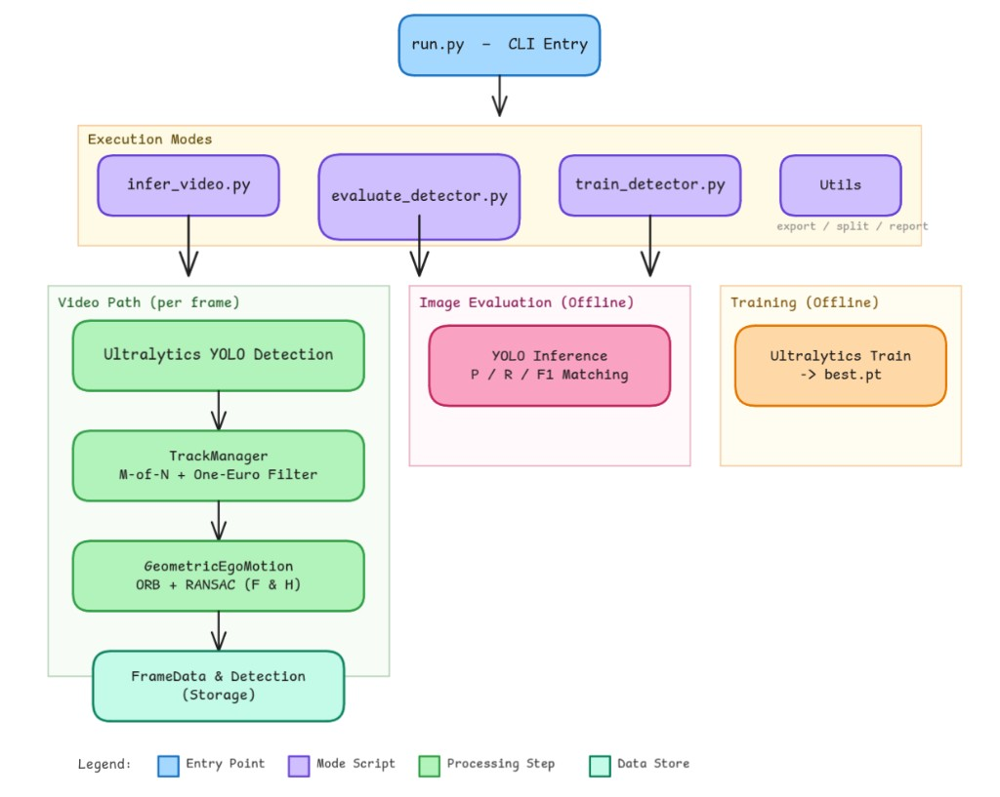

# AeroSentry — CV engineer assignment 

End-to-end **YOLO11** training on a YOLO-format image dataset, **offline evaluation** on image splits, and **video inference** with an optional **false-positive reduction** layer.


---

## Setup 

**Requirements:** Python **3.10+**.

From the repo root:

```bash
python3 -m venv .venv
source .venv/bin/activate    # Windows: .venv\Scripts\activate
pip install -U pip
pip install -r requirements.txt
export PYTHONPATH=.
```

Edit **`config/dataset_aerosentry.yaml`** so `path`, `train`, `val`, and `test` point to a valid YOLO layout on disk.

---

## Produce weights

Weights are **not** committed. After training you get `best.pt` under `runs/detect/aerosentry/<run_name>/weights/`.


Minimal flow:

```bash
python3 run.py train --experiment A    # baseline — use B for domain-style augmentations
find runs -name best.pt
```

Resume: `python3 run.py train --experiment A --resume runs/detect/aerosentry/<run>/weights/last.pt`

---

## Run the model

**Metrics on image splits** :

```bash
python3 run.py eval \
  --weights /path/to/best.pt \
  --data config/dataset_aerosentry.yaml \
  --split test \
  --device 0
```

**Video with boxes** :

```bash
mkdir -p outputs
python3 run.py infer \
  --weights /path/to/best.pt \
  --source /path/to/video.mp4 \
  --device 0 \
  --conf 0.25 \
  --out outputs/annotated.mp4
```

**With FP reduction:** add `--fp-suppressor` (or `--fp-geo-only` for geometry-only ablation). Tuning lives in **`config/tracking_fp.yaml`** (see [Hybrid inference and false-positive filtering](#hybrid-inference-and-false-positive-filtering)).

```bash
mkdir -p outputs
python3 run.py compare-fp-video \
  --weights runs/detect/aerosentry/yolo11_baseline-4/weights/best.pt \
          runs/detect/aerosentry/yolo11_domain_aug-2/weights/best.pt \
  --names baseline domain_aug \
  --video "Video Analytics/Test Footage/Arsuf F1 09_04_2025 - Made with Clipchamp.mp4" \
  --device 0 --conf 0.25 --imgsz 640 \
  --out-md outputs/fp_video_compare_arsuf.md

python3 run.py compare-fp-video \
  --weights runs/detect/aerosentry/yolo11_baseline-4/weights/best.pt \
          runs/detect/aerosentry/yolo11_domain_aug-2/weights/best.pt \
  --names baseline domain_aug \
  --video outputs/poster.mp4 \
  --device 0 --conf 0.25 --imgsz 640 \
  --out-md outputs/fp_video_compare_poster.md
```

Adjust `--video` and checkpoint paths for your machine.

---

## Hybrid inference and false-positive filtering


This repository supports **two related ideas**: (1) a **cascaded hybrid detector** that can swap to a heavier model on difficult frames, and (2) an optional **false-positive (FP) suppression** stage that uses short-term tracking plus egomotion-consistent geometry. They compose cleanly: detect first, then filter.


### 🎥 Visual Demonstration
<div align="center">
  <video src="כאן_תדביק_את_הלינק_שקיבלת_אחרי_שגררת_את_הוידאו" width="100%" controls>
    Your browser does not support the video tag.
  </video>
  <p><i>Left: Standard YOLO inference | Right: Hybrid pipeline with Geometric FP Suppression and RT-DETR fallback</i></p>
</div>

---
### Cascaded hybrid detector (`HybridDetector`)

The hybrid path is implemented in `src/models/hybrid_detector.py` and exercised end-to-end in **`examples/hybrid_video_demo.py`** (not wired into `run.py infer`, which runs a single YOLO checkpoint).

**Default behavior**

1. **Primary pass — YOLO**  
   Every valid frame is scored by your trained YOLO weights. Detections below the YOLO confidence cutoff are discarded at source.

2. **Fallback pass — RT-DETR (same frame)**  
   If cooldown is inactive, RT-DETR is run **on the same BGR image** when **either** condition holds:
   - **Semantic uncertainty:** YOLO produced at least one box, but the **maximum class score** is below `uncertainty_thresh` (low-confidence detections are prime candidates for a second opinion).
   - **Spatial / track prior:** YOLO produced **no** boxes **and** the outer loop reports **track loss** (in the demo, a lightweight “miss streak” after post-processing).

   On fallback, **YOLO boxes for that frame are discarded** and the pipeline returns RT-DETR boxes instead. A **cooldown** counter is started so the system cannot oscillate between models every frame (during cooldown, only YOLO runs and fallback triggers are ignored).

**Outputs**

- `detect` returns an `(N, 6)` array per frame: pixel `xyxy`, score, and class id.  
- Flags such as `used_rtdetr_last` and `last_state` expose which branch executed.

**Practical caveats**

- **Class spaces:** Off-the-shelf RT-DETR weights are typically COCO-trained; your UAV YOLO head may use a **different class index layout**. Treat fallback as a **robustness aid**, not a drop-in label match, unless you train or remap heads.
- **Cost:** RT-DETR is much heavier than a small YOLO; cooldown limits how often you pay that cost.
- **CLI vs YAML:** In the hybrid demo, YOLO confidence can be set with `--yolo-conf` or, when `config/tracking_fp.yaml` is loaded, via `hybrid_demo_detector.yolo_conf` (CLI wins if you pass `--yolo-conf`).

### False-positive suppressor (`FalsePositiveSuppressor`)

The FP stage (`src/tracking/fp_suppressor.py`) sits **after** raw detector output. It consumes **`Detection`** objects (normalized YOLO-style boxes); the hybrid demo converts `HybridDetector`’s pixel tensor accordingly.

**Full mode (`--fp-suppressor` in `infer` / hybrid demo)**

1. **`TrackManager`** — Greedy association by class and IoU, **M-of-N temporal voting** to confirm a track, and **One Euro** smoothing on box coordinates to reduce jitter.
2. **Global geometry (`GeometricEgoMotion`)** — For **confirmed** tracks, consecutive frames are matched with ORB features; RANSAC estimates a **fundamental matrix F** and a **homography H** for the dominant scene motion. Keypoints **inside** each track’s ROI are tested for consistency with that dominant motion. Regions that behave like **static background or planar clutter** (high inlier ratios under F / H) are treated as likely FPs and **dropped**; targets that move **inconsistently** with the bulk motion are kept as **airborne** candidates.

**Optional behaviour**

- **`emit_unconfirmed_tracks` (YAML: `fp_suppressor`)** — When enabled, **hits that are not yet M-of-N confirmed** can still be emitted for visualization/latency-sensitive use; **no** geometric gate is applied to those tentative hits (confirmed tracks remain geometry-gated). When disabled, only confirmed tracks are output (stricter, can hide short flashes).

**Geometry-only mode (`--fp-geo-only`)**

- Skips `TrackManager`. **Every** raw detection (after the first frame, when a previous image exists) is passed through the same global F/H gate. Useful as an **ablation** to isolate geometry vs temporal voting (`run.py compare-fp-video` reports raw vs full FP vs geo-only).

### Configuration file (`config/tracking_fp.yaml`)

A single YAML file centralizes tuning so you do not need to edit Python entrypoints:

| Section | Role |
| -------- | ---- |
| `track_manager` | M-of-N voting, IoU association, miss streak, One Euro parameters |
| `geometric_ego_motion` | ORB/RANSAC and inlier-ratio thresholds for the F/H gate |
| `fp_suppressor` | e.g. `emit_unconfirmed_tracks` |
| `hybrid_demo_detector` | `yolo_conf` for **`examples/hybrid_video_demo.py`** when `--yolo-conf` is omitted |
| `hybrid_demo_mock_tracker` | Demo-only threshold for consecutive empty post-FP frames before “track lost” |

**Loading rules**

- **`tools/infer_video.py` / `run.py infer`:** YAML is read when `--fp-suppressor` or `--fp-geo-only` is set, using `config/tracking_fp.yaml` if it exists unless you pass `--fp-config` or `--fp-no-config`.
- **`examples/hybrid_video_demo.py`:** If `config/tracking_fp.yaml` exists and **`--fp-no-config` is not set**, it is loaded for hybrid-demo detector/mock-track settings and for FP construction when `--fp-suppressor` / `--fp-geo-only` is used (`--fp-config` selects another path).

For a deeper architectural narrative (data contracts, coupling between FP and `is_track_lost`, GT benchmarking), see **`docs/HYBRID_AND_FP_ARCHITECTURE.md`**.

### Example: hybrid demo with FP suppression

```bash
cd /path/to/aerosentry_task
export PYTHONPATH=.
python3 examples/hybrid_video_demo.py \
  --video /path/to/clip.mp4 \
  --yolo runs/detect/.../weights/best.pt \
  --rtdetr rtdetr-l.pt \
  --device 0 \
  --max-frames 0 \
  --out outputs/hybrid_annotated.mp4 \
  --fp-suppressor
```

---

## Written report & Pipeline architecture

<p align="center">
  
</p>

The **report**: [REPORT](Computer_Vision_Engineer_Task.pdf).

---

## Demo (see the system run)

Pick one or more:

- **Short annotated videos:** run `infer` with `--out` (and optionally `--fp-suppressor`) on provided test footage.  
- **Quantitative demo:** `compare-fp-video` writes Markdown/CSV/JSON under `outputs/` (see `--out-md`).  
- **On-disk examples:** optional annotated clips under `outputs/`.

**FP reduction on a “poster” sequence (UAV-on-floor style frames):** same clip processed **raw** vs **with full FP suppressor**. The two MP4s under `outputs/` are **tracked in git** so they play from this README on GitHub; regenerate anytime with `infer` below.

<p align="center"><strong>Raw detector</strong> — all boxes kept</p>
<video src="outputs/poster.mp4" controls playsinline width="640"></video>

<p align="center"><strong>Full FP suppressor</strong> (`--fp-suppressor`)</p>
<video src="outputs/poster_fp_reducer.mp4" controls playsinline width="640"></video>

| Clip | What it shows |
| --- | --- |
| [`outputs/poster.mp4`](outputs/poster.mp4) | Raw detector — all boxes kept. |
| [`outputs/poster_fp_reducer.mp4`](outputs/poster_fp_reducer.mp4) | Same source with **full** FP suppressor — fewer spurious boxes on background / floor. |

Regenerate the pair from the same input clip (only the second run adds `--fp-suppressor`):

```bash
python3 run.py infer --weights /path/to/best.pt --source <input.mp4> \
  --device 0 --conf 0.25 --out outputs/poster.mp4
python3 run.py infer --weights /path/to/best.pt --source <input.mp4> \
  --device 0 --conf 0.25 --fp-suppressor --out outputs/poster_fp_reducer.mp4
```

```bash
python3 run.py --help
```

---
