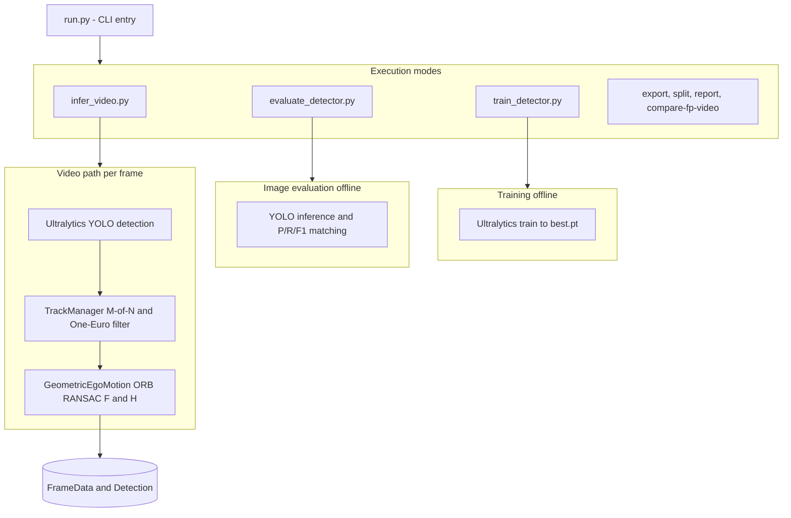

# AeroSentry — CV engineer assignment 

End-to-end **YOLO11** training on a YOLO-format image dataset, **offline evaluation** on image splits, and **video inference** with an optional **false-positive reduction** layer.


---

## Setup 

**Requirements:** Python **3.10+**.

From the repo root:

```bash
python3 -m venv .venv
source .venv/bin/activate    # Windows: .venv\Scripts\activate
pip install -U pip
pip install -r requirements.txt
export PYTHONPATH=.
```

Edit **`config/dataset_aerosentry.yaml`** so `path`, `train`, `val`, and `test` point to a valid YOLO layout on disk.

---

## Produce weights

Weights are **not** committed. After training you get `best.pt` under `runs/detect/aerosentry/<run_name>/weights/`.


Minimal flow:

```bash
python3 run.py train --experiment A    # baseline — use B for domain-style augmentations
find runs -name best.pt
```

Resume: `python3 run.py train --experiment A --resume runs/detect/aerosentry/<run>/weights/last.pt`

---

## Run the model

**Metrics on image splits** :

```bash
python3 run.py eval \
  --weights /path/to/best.pt \
  --data config/dataset_aerosentry.yaml \
  --split test \
  --device 0
```

**Video with boxes** :

```bash
mkdir -p outputs
python3 run.py infer \
  --weights /path/to/best.pt \
  --source /path/to/video.mp4 \
  --device 0 \
  --conf 0.25 \
  --out outputs/annotated.mp4
```

**With FP reduction:** add `--fp-suppressor` (or `--fp-geo-only` for geometry-only ablation).

```bash
mkdir -p outputs
python3 run.py compare-fp-video \
  --weights runs/detect/aerosentry/yolo11_baseline-4/weights/best.pt \
          runs/detect/aerosentry/yolo11_domain_aug-2/weights/best.pt \
  --names baseline domain_aug \
  --video "Video Analytics/Test Footage/Arsuf F1 09_04_2025 - Made with Clipchamp.mp4" \
  --device 0 --conf 0.25 --imgsz 640 \
  --out-md outputs/fp_video_compare_arsuf.md

python3 run.py compare-fp-video \
  --weights runs/detect/aerosentry/yolo11_baseline-4/weights/best.pt \
          runs/detect/aerosentry/yolo11_domain_aug-2/weights/best.pt \
  --names baseline domain_aug \
  --video outputs/poster.mp4 \
  --device 0 --conf 0.25 --imgsz 640 \
  --out-md outputs/fp_video_compare_poster.md
```

Adjust `--video` and checkpoint paths for your machine.

---

## Written report & Pipeline architecture




The **report**: [REPORT](Computer_Vision_Engineer_Task.pdf).

---

## Demo (see the system run)

Pick one or more:

- **Short annotated videos:** run `infer` with `--out` (and optionally `--fp-suppressor`) on provided test footage.  
- **Quantitative demo:** `compare-fp-video` writes Markdown/CSV/JSON under `outputs/` (see `--out-md`).  
- **On-disk examples:** optional annotated clips under `outputs/`.

**FP reduction on a “poster” sequence (UAV-on-floor style frames):** side-by-side style demo clips you can open locally after running `infer` (or use the committed examples if present in your tree):

| Clip | What it shows |
| --- | --- |
| [`outputs/poster.mp4`](outputs/poster.mp4) | Raw detector — all boxes kept. |
| [`outputs/poster_fp_reducer.mp4`](outputs/poster_fp_reducer.mp4) | Same source with **full** FP suppressor (`--fp-suppressor`) — fewer spurious boxes on background / floor. |

Regenerate the pair from the same input clip (only the second run adds `--fp-suppressor`):

```bash
python3 run.py infer --weights /path/to/best.pt --source <input.mp4> \
  --device 0 --conf 0.25 --out outputs/poster.mp4
python3 run.py infer --weights /path/to/best.pt --source <input.mp4> \
  --device 0 --conf 0.25 --fp-suppressor --out outputs/poster_fp_reducer.mp4
```

```bash
python3 run.py --help
```

---
