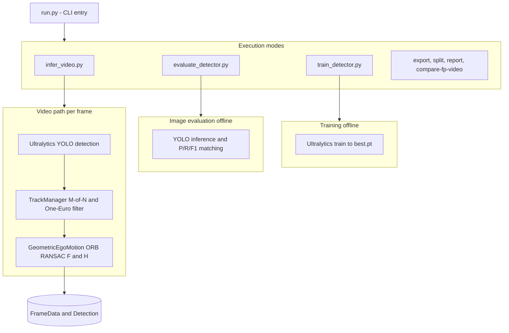

# AeroSentry — CV engineer assignment (pipeline)

End-to-end **YOLO11** training on a YOLO-format image dataset, **offline evaluation** on image splits, and **video inference** with an optional **false-positive reduction** layer.

This repository is **code only**: datasets, videos, and `*.pt` checkpoints stay local (see `.gitignore`). Set paths in **`config/dataset_aerosentry.yaml`**.


---

## Setup 

**Requirements:** Python **3.10+**, CUDA optional (use `--device cpu` if needed).

From the repo root:

```bash
python3 -m venv .venv
source .venv/bin/activate    # Windows: .venv\Scripts\activate
pip install -U pip
pip install -r requirements.txt
export PYTHONPATH=.
```

Edit **`config/dataset_aerosentry.yaml`** so `path`, `train`, `val`, and `test` point to a valid YOLO layout on disk.

---

## Produce weights

Weights are **not** committed. After training you get `best.pt` under `runs/detect/aerosentry/<run_name>/weights/`.

**Step-by-step (no Docker):** [`docs/SUBMISSION.md`](docs/SUBMISSION.md)

Minimal flow:

```bash
python3 run.py train --experiment A    # baseline — use B for domain-style augmentations
find runs -name best.pt
```

Resume: `python3 run.py train --experiment A --resume runs/detect/aerosentry/<run>/weights/last.pt`

---

## Run the model

**Metrics on image splits** (P/R/F1 sweep over confidence thresholds):

```bash
python3 run.py eval \
  --weights /path/to/best.pt \
  --data config/dataset_aerosentry.yaml \
  --split test \
  --device 0
```

**Video with boxes** (writes an MP4):

```bash
mkdir -p outputs
python3 run.py infer \
  --weights /path/to/best.pt \
  --source /path/to/video.mp4 \
  --device 0 \
  --conf 0.25 \
  --out outputs/annotated.mp4
```

**With FP reduction:** add `--fp-suppressor` (or `--fp-geo-only` for geometry-only ablation).

**Video benchmark table** — `python3 run.py compare-fp-video` runs three full passes per checkpoint (Raw, Full FP, Geo-only). Example below uses `conf=0.25` and `imgsz=640`; two clips, separate `--out-md` so runs do not overwrite each other. Filled-in sample tables: [`docs/REPORT.md`](docs/REPORT.md).

```bash
mkdir -p outputs
python3 run.py compare-fp-video \
  --weights runs/detect/aerosentry/yolo11_baseline-4/weights/best.pt \
          runs/detect/aerosentry/yolo11_domain_aug-2/weights/best.pt \
  --names baseline domain_aug \
  --video "Video Analytics/Test Footage/Arsuf F1 09_04_2025 - Made with Clipchamp.mp4" \
  --device 0 --conf 0.25 --imgsz 640 \
  --out-md outputs/fp_video_compare_arsuf.md

python3 run.py compare-fp-video \
  --weights runs/detect/aerosentry/yolo11_baseline-4/weights/best.pt \
          runs/detect/aerosentry/yolo11_domain_aug-2/weights/best.pt \
  --names baseline domain_aug \
  --video outputs/poster.mp4 \
  --device 0 --conf 0.25 --imgsz 640 \
  --out-md outputs/fp_video_compare_poster.md
```

Adjust `--video` and checkpoint paths for your machine.

---

## Written report 

Pipeline architecture




The assignment asks for a **short report (3–6 pages)** covering:

- Architecture diagram and pipeline walk-through  
- Model choice, training setup, and training-curve diagnostics  
- FP-reduction approach and alternatives considered  
- **Jetson Orin Nano** deployment plan: precision, expected latency, memory, risks  
- Evaluation setup, metrics, results on **`test/`** and **`test_footage/`**, and limitations  
- **“Another week”** improvements  

**Submitted write-up:** add your PDF beside the repo and link it here, for example:

[Written report (PDF)](docs/REPORT_SUBMISSION.pdf)

*(Replace the path with your actual filename if different.)*

---

## Demo (see the system run)

Pick one or more:

- **Short annotated videos:** run `infer` with `--out` (and optionally `--fp-suppressor`) on provided test footage.  
- **Quantitative demo:** `compare-fp-video` writes Markdown/CSV/JSON under `outputs/` (see `--out-md`).  
- **On-disk examples:** optional annotated clips under `outputs/`.

```bash
python3 run.py --help
```

---

## License / privacy

Do not commit sensitive dataset paths or customer footage in public forks; keep local paths in `config/dataset_aerosentry.yaml` only.
