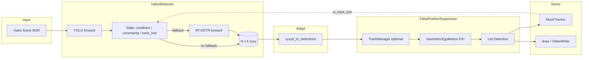

# Hybrid cascaded inference and False-Positive suppression — architecture reference

This document explains how **`examples/hybrid_video_demo.py`** stitches together the **hybrid detector** (`HybridDetector`: YOLO + RT-DETR fallback) with the project’s **`FalsePositiveSuppressor`** (temporal tracking + geometric ego-motion gating), and how that composition relates to the rest of the AeroSentry repository (`tools/infer_video.py`, training, evaluation).

It is written for engineers who need to **reason about ordering, data types, state, and failure modes** when extending the pipeline (e.g. Jetson deployment, different trackers, or calibrated geometry).

---

## 1. Role in the repository

| Component | Primary entry | Responsibility |
|-----------|---------------|----------------|
| **Training** | `run.py train` → `src/models/train_detector.py` | Ultralytics YOLO weights (`best.pt`, `last.pt`). |
| **Image metrics** | `run.py eval` → `src/models/evaluate_detector.py` | P/R/F1 vs YOLO labels on `train` / `val` / `test` splits. |
| **Video (single model)** | `run.py infer` → `tools/infer_video.py` | `UltralyticsYoloDetector.predict` → optional `FalsePositiveSuppressor` → draw / write MP4. |
| **Video (hybrid + optional FP)** | `examples/hybrid_video_demo.py` | `HybridDetector.detect` → convert to `Detection` → optional `FalsePositiveSuppressor` → draw / write MP4 / optional GT stats. |
| **Video benchmark tables** | `run.py compare-fp-video` → `tools/benchmark_video_fp_compare.py` | Raw vs FP vs geo-only **operational** counts (and optional `--gt-json` TP/FP/FN). |

**`hybrid_video_demo.py` is a demonstration / integration harness**, not wired into `run.py` today. It exists to validate the **facade pattern** from the assignment spec (one object that looks like a detector to the rest of the loop, with internal model switching). Production wiring would mirror this loop inside `infer_video` or a dedicated subcommand.

---

## 2. Data contracts (why conversion happens twice)

The project standard for “downstream” stages is **`Detection`** in **normalized YOLO xywh** (center x, center y, width, height in \([0,1]\)), defined in `src/core/data_contracts.py`.

**`HybridDetector.detect`** deliberately returns a **NumPy** array of shape **`(N, 6)`** with **pixel-space `xyxy`**, plus confidence and class:

\[
\text{columns} = [x_1, y_1, x_2, y_2, \texttt{conf}, \texttt{class\_id}]
\]

**Rationale:**

- Geometric code and some research tooling consume **pixel `xyxy`** directly.
- **`FalsePositiveSuppressor`** is implemented against **`FrameData`** carrying **`List[Detection]`** in **normalized xywh** — the same contract as `infer_video.py`.

Therefore **`hybrid_video_demo.py`** performs:

1. **`xyxy6_to_detections`** (`src/models/hybrid_detector.py`): `(N,6)` pixel → `List[Detection]` normalized.
2. **`FalsePositiveSuppressor.process(frame_data)`** → filtered `List[Detection]`.
3. **`_detections_to_xyxy6`** (local helper in the demo): back to `(N,6)` pixels for **drawing** and for the demo’s **`MockTracker`**, which counts empty tensors.

> **Numerical note:** round-trip xyxy → normalized xywh → xyxy can introduce tiny rounding differences at boundaries; for FP gating this is negligible relative to IoU / geometry thresholds.

---

## 3. `HybridDetector` — cascaded inference (deep dive)

**Source:** `src/models/hybrid_detector.py`.

### 3.1 Design pattern: Facade

- **Single public inference method** for the “outer” loop: `detect(frame, is_track_lost=False)`.
- **Internally** holds **two** Ultralytics `YOLO` objects, loaded **once** in `__init__` (no lazy reload per frame).
- Default backbone: primary **YOLO** (your trained `best.pt` or a hub name), secondary **RT-DETR** (e.g. `rtdetr-l.pt`).

### 3.2 Output and branch flag

- Returns **`(N,6)`** `float32` as described above.
- **`used_rtdetr_last`**: `True` iff the **last** `detect` call **replaced** YOLO output with RT-DETR output for that frame.
- **`last_state`**: `HybridDetectorState.YOLO` or **`COOLDOWN`** (never an explicit “FALLBACK” enum — fallback is a **transient** branch inside `detect`).

### 3.3 State machine (per frame)

1. **Invalid frame** → empty `(0,6)` array; `used_rtdetr_last = False`.

2. **Cooldown active** (`cooldown_remaining > 0`):
   - Decrement counter.
   - Set `last_state = COOLDOWN`.
   - Run **YOLO only**; **do not** evaluate fallback triggers.
   - **Purpose:** prevent **oscillation** YOLO ↔ RT-DETR YOLO ↔ RT-DETR on difficult sequences.

3. **Normal evaluation** (`cooldown_remaining == 0`):
   - Set `last_state = YOLO`.
   - Run YOLO → `yolo_out`.

4. **Fallback test** — run RT-DETR on the **same BGR frame** iff **either**:

   - **Condition A (semantic uncertainty):** `yolo_out` has **≥ 1** box **and** \(\max(\text{conf}) < \texttt{uncertainty\_thresh}\) (default `0.55`).  
     - YOLO’s own `conf` argument (e.g. `0.25`) still allows boxes in `[0.25, 0.55)` to appear; those are prime fallback candidates.
   - **Condition B (spatial / track prior):** `yolo_out` is **empty** **and** `is_track_lost` is **True** (supplied by **external** logic; see §5 — mock vs real tracking).

5. If fallback triggers:
   - **Discard** YOLO boxes for this frame.
   - Run RT-DETR → return its `(N,6)`.
   - Set `cooldown_remaining = cooldown_frames` (default `10`).
   - Set `used_rtdetr_last = True`.

6. Else return `yolo_out`.

### 3.4 `predict_yolo_only`

- Bypasses cooldown + RT-DETR.
- Used in **`hybrid_video_demo.py`** for **GT ablation** (compare hybrid vs YOLO-only micro TP/FP/FN when `--gt-json` is set).

### 3.5 Operational caveats (must-read for honest reporting)

- **RT-DETR weights from Ultralytics** are typically trained on **COCO** (80 classes). Your **UAV detector** uses **`nc: 2`** in `config/dataset_aerosentry.yaml`. **Class IDs and semantics do not align** unless you train or remap heads.
- Fallback **improves robustness heuristically** on hard frames; it does **not** guarantee higher **TP** without domain-matched heavy weights and compatible label spaces.
- **Latency:** RT-DETR is much **heavier** than nano YOLO; fallback frames are expensive. Cooldown limits **how often** you pay that cost.

---

## 4. `FalsePositiveSuppressor` — temporal + geometric gate (deep dive)

**Source:** `src/tracking/fp_suppressor.py`.

### 4.1 Modes

| Mode | Flag in demo | What runs |
|------|----------------|-----------|
| **Full** | `--fp-suppressor` | `TrackManager` → only **confirmed** tracks → **GeometricEgoMotion** on those ROIs. |
| **Geo-only** | `--fp-geo-only` | **No** `TrackManager`; **every** raw detection (per frame) passed through **global** F/H gate (after frame 0). |

Mutually exclusive in argparse (same as `infer_video.py`).

### 4.2 Full path (`_process_with_tracks`) — summary

1. Convert input `List[Detection]` to per-frame arrays; call `TrackManager.update`.
2. Determine **`confirmed_hits`**: tracks that are both **hit** this frame and **confirmed** (M-of-N window full).
3. If there is at least one confirmed track **and** a previous BGR frame exists:
   - **ORB** keypoints + match between `prev_bgr` and current frame (CUDA path if available in OpenCV build; else CPU — see `GeometricEgoMotion` module doc).
   - **RANSAC** to estimate **fundamental matrix `F`** and **homography `H`** with inlier masks.
4. For each **surviving** confirmed track:
   - Run **`analyze_bbox_motion`** on the **smoothed** xywh box: decides if the motion of features inside the ROI is **consistent with “airborne”** vs **background / planar** dominance.
5. Output filtered `List[Detection]` including **`track_id`**.
6. Advance `_prev_bgr` and smoothed box cache for next frame.

**Why this can remove many true boxes:**  
Temporal confirmation **delays** outputs; geometry may **reject** small or texture-poor UAVs if ORB support inside the ROI is weak, thresholds are strict, or the global motion model fits the whole frame well (false “background” classification).

### 4.3 Geo-only path (`_process_geo_only`) — summary

1. If **no** detections: still updates `_prev_bgr`; returns empty list.
2. If **no** `prev_bgr`: **cannot** run geometry → **keeps all** current detections (first frame or after reset).
3. Else: same global **`F` / `H`** estimation from pairwise ORB matches.
4. **Every** detection (not only confirmed tracks) is tested with **`analyze_bbox_motion`**; survivors kept.

**Typical use:** user wants **less aggressive** FP control than full TrackManager — closer to “pure geometry ablation” as in `compare-fp-video`.

### 4.4 `GeometricEgoMotion` — conceptual model

**Source:** `src/tracking/geometric_ego_motion.py` (module docstring is authoritative).

- Fits **dominant scene motion** between consecutive frames using **epipolar (`F`)** and **planar (`H`)** interpretations.
- **Hypothesis:** false positives on **posters / ground / clutter** move **with** the dominant model; a **real UAV** may exhibit **relative** motion inconsistent with that bulk (parallax, off-plane).
- **Tunables:** RANSAC thresholds, inlier ratio cutoffs, minimum points in bbox, ORB `fast_threshold`, ROI margin, skip area for tiny boxes.
- **Debug:** `AEROSENTRY_GEO_DEBUG=1` or `--geo-debug` in the demo / `infer`.

---

## 5. Two different “trackers” in `hybrid_video_demo.py`

The demo uses **two unrelated concepts** both related to “tracking”:

### 5.1 `MockTracker` (outer loop) — `is_track_losing_track`

- **Purpose:** feed **`is_track_lost`** into `HybridDetector.detect` for **Condition B**.
- **Call order in the demo:** `lost = tracker.is_losing_track()` runs **before** `tracker.update(...)` for the current frame. So **`lost` reflects consecutive **post-FP** empty outputs on **prior** frames**, not the current frame’s FP result yet.
- **Logic:** increments a **miss** counter when **post-FP** `dets_xyxy6` is empty on `update`; after `miss_threshold` (default 2) consecutive misses, `is_losing_track()` returns `True`.
- **Important:** When FP is enabled, **aggressive suppression** can lengthen empty streaks → **more** RT-DETR fallback triggers on later frames → **coupling** between FP policy and hybrid policy.

### 5.2 `TrackManager` (inside `FalsePositiveSuppressor`) — full FP mode only

- **Purpose:** **M-of-N** votes, IoU association, **One Euro** smoothing on normalized boxes (`src/tracking/track_manager.py`).
- **Confirmed tracks** get **geometric** checks (see §4.2–§4.4).
- **Not** exposed to `HybridDetector` as `is_track_lost` in the demo.

**Production improvement:** derive `is_track_lost` from **real** MOT logic (e.g. confirmed track dropped) instead of the mock, and consider whether FP should run **before** or **after** hybrid cascade for your threat model.

---

## 6. Per-frame pipeline in `hybrid_video_demo.py`

**Pseudocode (conceptual):**

```
open VideoCapture
optional: load_gt_json
construct HybridDetector(yolo_weights, rtdetr_weights, ...)
optional: suppressor = FalsePositiveSuppressor(geo_only=...) or default
construct MockTracker

for each frame:
    lost = mock_tracker.is_losing_track()  # prior frames' post-FP emptiness (see §5.1)

    dets_raw = hybrid.detect(frame, is_track_lost=lost)

    if suppressor:
        det_list = xyxy6_to_detections(dets_raw, frame.shape)
        fd = FrameData(frame, frame_id, timestamp, det_list)
        fd = suppressor.process(fd)
        dets = detections_to_xyxy6(fd.detections, w, h)
    else:
        dets = dets_raw

    mock_tracker.update(frame_id, dets)

    optional: accumulate match_image vs GT on dets and on predict_yolo_only

    vis = draw_xyxy6_overlay(..., used_rtdetr=hybrid.used_rtdetr_last, fp_applied=suppressor!=None)
    write/show vis
```

**Banner semantics:**

- **`YOLO` vs `RT-DETR`:** source of **boxes before FP** (from `used_rtdetr_last`).
- **`YOLO` vs `COOLDOWN`:** hybrid state machine (cooldown still runs YOLO only).
- **`| FP`:** any FP path active (full or geo-only — same label today; extend if you need `| FP-FULL` vs `| GEO`).

---

## 7. Comparison: `infer_video.py` vs `hybrid_video_demo.py`

| Aspect | `infer_video.py` | `hybrid_video_demo.py` |
|--------|------------------|-------------------------|
| Detector | `UltralyticsYoloDetector` → `List[Detection]` | `HybridDetector` → `(N,6)` → converted |
| FP | Optional `--fp-suppressor` / `--fp-geo-only` | Same classes, same `process(FrameData)` |
| Hybrid / RT-DETR | No | Yes (cascade + cooldown) |
| `is_track_lost` | N/A | Yes (`MockTracker`) |
| GT metrics | No | Optional `--gt-json` |

---

## 8. CLI reference (`hybrid_video_demo.py`)

| Argument | Meaning |
|----------|---------|
| `--video` | Input path. |
| `--yolo` | Primary weights (your trained `.pt` or hub name). |
| `--rtdetr` | Fallback weights (default `rtdetr-l.pt`). |
| `--device` | Ultralytics device (`0`, `cpu`, …). |
| `--imgsz`, `--yolo-conf` | Passed into YOLO predict. |
| `--uncertainty-thresh` | Condition A threshold. |
| `--cooldown` | Frames of forced YOLO-only after a fallback. |
| `--fp-suppressor` | Full FP (TrackManager + geometry). |
| `--fp-geo-only` | Geometry only (mutually exclusive with above). |
| `--geo-debug` | Sets `AEROSENTRY_GEO_DEBUG=1`. |
| `--out` / `--show` | Visual output (required unless `--gt-json` alone). |
| `--gt-json` | Per-frame GT for micro TP/FP/FN summary. |
| `--max-frames` | `0` = full clip. |

---

## 9. GT evaluation (optional)

When `--gt-json` is provided:

- Uses **`match_image`** from `src/models/evaluate_detector.py` (greedy IoU + class match).
- Aggregates **micro** TP/FP/FN over processed frames for:
  - **Hybrid + post-FP** path (what you draw).
  - **YOLO-only** (`predict_yolo_only`) — **not** hybrid, **not** RT-DETR, **no** FP — for a **partial** baseline.
- **Interpretation caution:** YOLO-only line does **not** include RT-DETR or FP; it isolates the **primary YOLO head**. For a full study you may want additional baselines (hybrid without FP, RT-DETR only, etc.).

---

## 10. Failure modes and tuning checklist

1. **No boxes after FP:** lower `vote_m` / raise `vote_n` (TrackManager), relax `GeometricEgoMotion` ratios, try **geo-only**, or skip FP on early `frame_id`.
2. **Too many RT-DETR triggers:** raise `uncertainty_thresh`, tighten `MockTracker` / real track-loss definition, lengthen `cooldown`.
3. **RT-DETR wrong classes:** train RT-DETR on your dataset or **disable** fallback for reporting runs; use hybrid only with domain-matched heavy model.
4. **CPU vs CUDA ORB:** same math, different speed; Jetson builds may differ — validate on target.
5. **Coupling FP → hybrid:** post-FP empty frames can spike `is_track_lost`; consider feeding **pre-FP** presence into hybrid policy if that matches ops requirements.

---

## 11. Diagram — data flow



---

## 12. Related files (quick index)

- `src/models/hybrid_detector.py` — cascade + conversions.
- `src/tracking/fp_suppressor.py` — FP facade.
- `src/tracking/track_manager.py` — temporal votes + smoothing.
- `src/tracking/geometric_ego_motion.py` — ORB + RANSAC + ROI test.
- `src/core/data_contracts.py` — `Detection`, `FrameData`.
- `tools/infer_video.py` — single-model reference loop.
- `tools/benchmark_video_fp_compare.py` — multi-pass FP benchmarking + optional GT.
- `examples/hybrid_video_demo.py` — integration demo described here.

---

*Last updated to match the repository layout and module behavior at authoring time; if APIs drift, compare against the source files cited above.*
