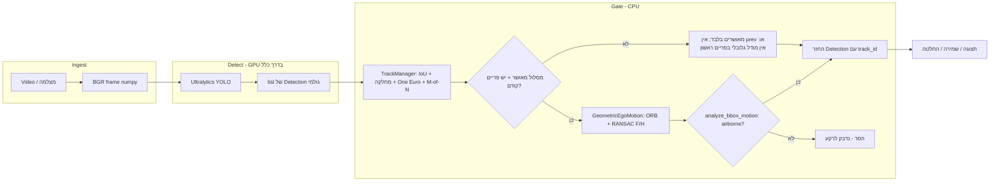

# מדריך עומק: AeroSentry — ארכיטקטורה, אלגוריתמים, pipeline ובדיקות

מסמך זה מפרט **בדיוק מה המימוש עושה** (לא רק “מה יש בתיקייה”), **איך האלגוריתמים עובדים לוגית ומתמטית**, **איך נראה end-to-end pipeline**, ו**איך לבדוק כל שכבה** כדי שתוכל להגן על ההחלטות בראיון. מונחים מקצועיים נשארים לעיתים באנגלית כמנהג התעשייה.

---

## תוכן עניינים

1. [מטרה והפרדת אחריות GPU/CPU](#1-מטרה-והפרדת-אחריות-gpucpu)
2. [מפת המאגר ונקודות כניסה (CLI)](#2-מפת-המאגר-ונקודות-כניסה-cli)
3. [Pipeline מקצה לקצה — תרשים, שלושה מסלולים, וסדר קריאת קוד](#3-pipeline-מקצה-לקצה--תרשים-שלושה-מסלולים-וסדר-קריאת-קוד)
4. [חוזי נתונים (`data_contracts`)](#4-חוזי-נתונים-data_contracts)
5. [דאטאסט, מחלקות, ואיפה נוצרים גרפי אימון](#5-דאטאסט-מחלקות-ואיפה-נוצרים-גרפי-אימון)
6. [ממשק מודל, Factory וסטאבים — מי קורא את מי](#6-ממשק-מודל-factory-וסטאבים--מי-קורא-את-מי)
7. [אימון — `train_detector.py`, `experiments.yaml`, ניסויים A/B/C לעומק](#7-אימון--train_detectorpy-experimentsyaml-ניסויים-abc-לעומק)
8. [הערכת תמונות — `evaluate_detector.py` לעומק (סweep, IoU, Greedy)](#8-הערכת-תמונות--evaluate_detectorpy-לעומק-sweep-iou-greedy)
9. [מסנן One Euro — איך זה עובד בקוד](#9-מסנן-one-euro--איך-זה-עובד-בקוד)
10. [`TrackManager` — שיבוץ, הצבעת M-of-N, מחיקת מסלולים](#10-trackmanager--שיבוץ-הצבעת-m-of-n-מחיקת-מסלולים)
11. [`GeometricEgoMotion` — ORB, מטריצות F/H, החלטת ROI](#11-geometricegomotion--orb-מטריצות-fh-החלטת-roi)
12. [`FalsePositiveSuppressor` — סדר פעולות ומטמון פריים](#12-falsepositivesuppressor--סדר-פעולות-ומטמון-פריים)
13. [`infer_video` — לולאת וידאו, FP suppressor אופציונלי, דיבוג](#13-infer_video--לולאת-וידאו-fp-suppressor-אופציונלי-דיבוג)
14. [`PipelineManager`, `demo`, והבדל מ־`infer`](#14-pipelinemanager-demo-והבדל-מinfer)
15. [הערכה טקטית — `tactical_evaluator`](#15-הערכה-טקטית--tactical_evaluator)
16. [כלים נלווים: `split_dataset`, `export_engine`, `generate_report`](#16-כלים-נלווים-split_dataset-export_engine-generate_report)
17. [איך בודקים — מטריצת בדיקות](#17-איך-בודקים--מטריצת-בדיקות)
18. [הכנה לראיון — נקודות הגנה](#18-הכנה-לראיון--נקודות-הגנה)
19. [מגבלות ידועות (כנות מקצועית)](#19-מגבלות-ידועות-כנות-מקצועית)
20. [סיכום משפט לראיון](#20-סיכום-משפט-לראיון)

---

## 1. מטרה והפרדת אחריות GPU/CPU

**מטרה מוצהרת:** מערכת זיהוי **כלי טיס קבועי־כנף (fixed-wing UAV)** בהקשר **יירוט**, עם גיבוי לפריסה על **Jetson Orin Nano** (זיכרון ו־throughput מוגבלים).

**עקרון ארכיטקטוני**

| רכיב | חומרה טיפוסית | תפקיד |
|------|----------------|--------|
| **YOLO (Ultralytics)** | GPU / מאיץ | מפיק תיבות, מזהה מחלקה, נותן **confidence** לכל זיהוי. |
| **שכבת מעקב + סינון** (`src/tracking/*`) | CPU (+ ORB על GPU אם `cv2.cuda`) | שיוך בין פריימים, החלקה **One Euro**, הצבעה **M-of-N**, ואחרי אישור — **גאומטריה דו־מבטית** (:math:`F` + :math:`H`) בלי רשת נוספת. |

כך נשמר **רוחב פס** למודל, והלוגיקה הטקטית נשארת **מפורטת, ניתנת לבדיקה, וזולה** יחסית בהספק.

### אימון מול זמן אמת

| שלב | קלט | קוד עיקרי |
|-----|-----|-----------|
| **אימון** | תמונות + תוויות YOLO (`path/train/val/test` ב־YAML) | `train_detector.py` → `YOLO.train` |
| **מדידות על סט תמונות** | אותן תיקיות | `evaluate_detector.py` דרך `run.py eval` |
| **ווידאו / דוח** | קובץ וידאו | `infer_video.py`, `generate_report.py` |
| **דמו צינור (סטאב)** | וידאו | `PipelineManager` + `DetectorFactory` |

פריימים בדאטאסט **יכולים** להיות שנחתכו מווידאו, אבל בשלב האימון המודל רואה **קבצי תמונה בלבד**.

---

## 2. מפת המאגר ונקודות כניסה (CLI)

**קובץ מרכזי:** `run.py` — ארגז הכלים של המטלה.

| פקודה | קובץ ליבה | תיאור קצר |
|--------|-----------|------------|
| `train` | `src/models/train_detector.py` | אימון YOLO11 לפי `config/experiments.yaml` (A / B / C). |
| `eval` | `src/models/evaluate_detector.py` | P / R / F1 / FDR על split תמונות; סweep ספי `conf` בתוכנה. |
| `infer` | `tools/infer_video.py` | וידאו + משקולות אמיתיות; אופציונלי `--fp-suppressor`. |
| `demo` | `src/pipeline/pipeline_manager.py` | צינור עם דטקטור **סטאב** + FP suppressor (בדיקת שלד). |
| `export` | `tools/export_engine.py` | PyTorch → ONNX → TensorRT (אם הסביבה תומכת). |
| `split` | `tools/split_dataset.py` | פיצול מודע־רצף (anti-leakage). |
| `report` | `tools/generate_report.py` | `TACTICAL_REPORT.md` + מדדים משולבים. |

**הרצה טיפוסית:** מתיקיית השורש של המאגר, עם `PYTHONPATH=.` (או `python3 -m` מתוך השורש עם path מוגדר).

---

## 3. Pipeline מקצה לקצה — תרשים, שלושה מסלולים, וסדר קריאת קוד

### 3.1 דיאגרמת זרימה לוגית (אחרי יעור GPU)

### 3.2 שלושה מסלולי pipeline מקבילים

1. **מסלול אימון (offline)**  
   `dataset_aerosentry.yaml` → תמונות/לייבלים → `YOLO.train` → תיקייה תחת `runs/detect/aerosentry/<name>/` כולל `results.png`, `best.pt`.

2. **מסלול הערכות תמונות (offline metrics)**  
   `gather_predictions`: לכל תמונה **הרצה אחת** עם `conf=0.001` (מועמדים רבים) → אחסון `pred_xyxy`, `pred_conf` → לכל סף ב־`--conf-thresholds` מחשבים TP/FP/FN עם `match_image` → הדפסה לטרמינל.

3. **מסלול וידאו (near real-time)**  
   `infer_video`: לכל פריים `UltralyticsYoloDetector.predict` עם **`--conf`** של המשתמש (ברירת מחדל לרוב 0.25) → אופציונלי `FalsePositiveSuppressor.process` → ציור → `VideoWriter` ו/או `imshow`.

**הבדל קריטי:** ב־**eval** הסף הנמוך הוא **0.001** והסינון הוא **אצלך בתוכנה**; ב־**infer** הסף **ראשון** הוא של Ultralytics (`--conf`).

### 3.3 סדר פעולות בפריים — קשר לקבצים

1. **כניסה:** `uint8` ‎`H×W×3` ‎BGR.
2. **גילוי:** `UltralyticsYoloDetector.predict` קורא ל־`model.predict(...)`; המרה מ־`xyxy` פיקסלים ל־**bbox מנורמל** ‎`[cx, cy, w, h]` ב־[0,1].
3. **מעקב:** `FalsePositiveSuppressor.process` → `TrackManager.update` עם **חותמת זמן מונוטונית** (`time.perf_counter()` ב־`infer_video`).
4. **יציאה:** רק זיהויים עם `hit`, **`is_confirmed`** (M-of-N), ועמידה ב־**גאומטריה** (`GeometricEgoMotion`) כשיש התאמות ומסכות RANSAC תקפות.
5. **מטמון:** `_advance_frame_cache` שומר `prev_bgr` ותיבות מוחלקות לפי `track_id`.

---

## 4. חוזי נתונים (`data_contracts`)

קובץ: `src/core/data_contracts.py`.

### `Detection`

- **`bbox`:** ‎`[x_center, y_center, width, height]` — **מנורמל לגודל התמונה** (יחסי ל־W ו־H).
- **`track_id`:** `Optional[int]` — ממולא אחרי `FalsePositiveSuppressor` כשיש מסלול מאושר.
- **`__post_init__`:** אורך bbox חייב להיות בדיוק 4.

**המרה לפיקסלים (לציור / IoU):**

\[
x_1 = (c_x - w/2)\,W,\quad y_1 = (c_y - h/2)\,H,\quad x_2 = (c_x + w/2)\,W,\quad y_2 = (c_y + h/2)\,H
\]

### `FrameData`

- **`frame`:** מערך NumPy; OpenCV = **BGR**.
- **`frame_id`:** אינדקס בלולאה.
- **`timestamp`:** שניות; **חייב להיות לא יורד** על פני רצף אם One Euro עקבי.

---

## 5. דאטאסט, מחלקות, ואיפה נוצרים גרפי אימון

קובץ: `config/dataset_aerosentry.yaml`.

- **`path`:** שורש הדאטאסט (יחסי למיקום ה־YAML).
- **`train` / `val` / `test`:** תת־נתיבים ל־`.../images` (Roboflow מייצא לרוב `valid` — ב־YAML ממופה ל־`val:`).
- **`nc: 2`**, **`names: ["none", "uav"]`:** שתי מחלקות סיווג; חשוב להבין בתיזה אם `none` הוא “רקע קשה” או תיוג אחר.

### גרפים תוך כדי אימון (Ultralytics)

נוצרים **בזמן** `model.train`, בדרך כלל תחת:

`runs/detect/<project>/<name>/`

בין השאר:

| קובץ / תבנית | תוכן |
|--------------|------|
| `results.png` | עקומות **train/val** ל־box / cls / dfl loss + precision / recall / mAP50 / mAP50-95 לפי epoch. |
| `results.csv` | אותם מספרים בטבלה. |
| `confusion_matrix*.png`, `BoxPR_curve.png`, … | הערכת **val** של Ultralytics בסוף/באמצע (תלוי גרסה והגדרות). |

**חשוב:** אלה משקפים בעיקר את **split ה־val מה־YAML**, לא בהכרח “ווידאו חדש”. הערכה על **test** מותאמת אישית דרך `run.py eval --split test` או `model.val(split='test', plots=True)`.

---

## 6. ממשק מודל, Factory וסטאבים — מי קורא את מי

קבצים: `src/models/base_detector.py`, `src/models/detector_factory.py`.

| מחלקה | מימוש | נקרא מ… |
|--------|--------|---------|
| `BaseDetector` | ABC + `predict` | תלוי יורש |
| `YOLOv11Detector` | **סטאב** — תיבה סינתטית במרכז | `DetectorFactory("yolov11")` → `PipelineManager` ללא הזרקה |
| `TensorRTDetector` | **סטאב** | `DetectorFactory("tensorrt")` |
| **`UltralyticsYoloDetector`** | **מימוש חי** — טעינת `.pt`, המרה ל־`Detection` | `infer_video.py`, `tactical_evaluator.py`, דרכי eval אחרים |

**למה יש סטאבים?** לאפשר **Strategy + Factory**: קוד צרכן (`PipelineManager`) לא תלוי ב־Ultralytics. במסלולי **production** בפועל בפרויקט זה משתמשים ב־`UltralyticsYoloDetector` ישירות ב־`infer`.

---

## 7. אימון — `train_detector.py`, `experiments.yaml`, ניסויים A/B/C לעומק

### 7.1 זרימת קונפיגורציה

1. נטען `experiments.yaml`: בלוק `global` + ניסוי **A / B / C**.
2. **`_merge_train_kwargs`:** `global.train` ממוזג עם `experiments.<X>.train` — ערכי הניסוי **דורסים** גלובליים.
3. **`_set_global_seed`:** Python / NumPy / PyTorch (+ CUDA).
4. **`WANDB_DISABLED=true`:** מוגדר בתחילת `run_training` — **אין** שימוש ב־Weights & Biases; לוגים מקומיים של Ultralytics.
5. **CUDA fallback:** אם אין GPU — מעבר ל־`cpu` + התאמות AMP.
6. **ניסוי B:** מחלקה `InterceptorAlbumentationsTrainer` — ב־`build_dataset(mode="train")` מוזרקות **albumentations** (טשטוש, בהירות, רעש) דרך `build_interceptor_camera_augmentations()`.
7. **ניסוי C:** פרמטרי loss/אופטימיזציה ב־YAML בלבד; **הנחה:** יש בתיקיית האימון תמונות עם **קבצי `.txt` ריקים** (שליליות).

### 7.2 טבלת ניסויים (ברירות עיקריות)

| ניסוי | שם ריצה טיפוסי (`name`) | הערה |
|--------|--------------------------|------|
| **A** | `yolo11_baseline` | Baseline: `mosaic: 1`, `mixup: 0`, ללא Albumentations מותאמים. |
| **B** | `yolo11_domain_aug` | חיזוק דומיין מצלמה: Albumentations + `mosaic`/`mixup`/`close_mosaic` שונים. |
| **C** | `yolo11_hard_negatives` | `cls` גבוה יותר, AdamW, `cls_pw`; **דורש** שליליות באימון. |

### 7.3 hyperparameters גלובליים (מינימום שכדאי לדעת בראיון)

- **`model: yolo11n.pt`:** נקודת התחלה **Nano** — קטנה, מהירה, מתאימה Orin; trade-off recall על מטרות זעירות.
- **`imgsz: 640`**, **`batch: 8`**, **`cache: true`:** אופטימיזציה ל־GPU ביתית ~4GB.

פלט: `runs/detect/aerosentry/<name>/weights/best.pt`.

---

## 8. הערכת תמונות — `evaluate_detector.py` לעומק (sweep, IoU, Greedy)

### 8.1 פתרון נתיבים

`_dataset_split_image_dir`: שורש = `path` ב־YAML, **יחסית לקובץ ה־YAML**; אז `train`/`val`/`test` מצורפים. כך לא נוצר `config/valid/images` בטעות.

### 8.2 טעינת GT

- **ששה מספרים:** `cls cx cy w h` מנורמל.
- **פוליגון:** אם יש יותר מ־5 ערכים ו־`(n-1)` זוגי — **תיבת צימוד** מקונטקסט הקואורדינטות המנורמלות.

### 8.3 `gather_predictions`

- לכל תמונה: `model.predict(..., conf=0.001, iou=0.7)` — שומרים **הכל** מעל ביטחון זעיר; **NMS** פנימי ל־Ultralytics.
- אין כאן FP suppressor — מדידה “גולמית” של הדטקטור מול GT.

### 8.4 `match_image` — greedy matching

עבור סף ביטחון קבוע `conf_thresh`:

1. מסננים תחזיות עם `pred_conf >= conf_thresh`.
2. ממיינים לפי confidence **יורד**.
3. לכל תחזית: מחפשים GT **באותה מחלקה** שלא נוצל, עם **IoU מקסימלי** מעל `iou_thresh` (ברירת `run.py eval`: 0.5).
4. התאמה ראשונה שעוברת — **TP**; אחרת **FP**. GT שלא נבחרו — **FN**.

**סיבוכיות:** לכל תמונה בערך O(P·G) עם P תחזיות ו־G GT (קטן בדרך כלל).

### 8.5 מדדים גלובליים

`aggregate_metrics`: מסכמים TP/FP/FN על **כל התמונות**, ואז:

- **Precision** = TP / (TP+FP)
- **Recall** = TP / (TP+FN)
- **F1**, **FDR** = 1 − Precision

מפתח המילון הוא מחרוזת הסף עם 2 ספרות אחרי הנקודה (למשל `"0.25"`).

---

## 9. מסנן One Euro — איך זה עובד בקוד

קובץ: `src/tracking/filters.py`. מבוסס על **1€ filter** (Casiez ועמיתים): החלקה חזקה במנוחה, מעקב מהיר כשיש תנועה.

### 9.1 סקלר — שלבים ב־`OneEuroFilter.filter(x, t)`

1. **Δt** מהקריאה הקודמת.
2. נגזרת מנוחית מ־EMA על המדידה.
3. EMA על הנגזרת עם cutoff מ־`d_cutoff`.
4. **cutoff דינמי:** `min_cutoff + beta * |derivative|` — תנועה גדולה ⇒ פחות החלקה ⇒ פחות lag.
5. **α** מהפונקציה `_smoothing_factor(dt, cutoff)` — מקשר לסינון אקספוננציאלי שקול לתדר.

### 9.2 `BoundingBoxOneEuroFilter`

ארבעה מופעים נפרדים ל־`cx, cy, w, h`. **w, h** מקובעים למינימום קטן למניעת תיבות לא חוקיות.

---

## 10. `TrackManager` — שיבוץ, הצבעת M-of-N, מחיקת מסלולים

קובץ: `src/tracking/track_manager.py`.

### 10.1 מצב מסלול (`_TrackState`)

- `bbox_filter`: One Euro **פר מסלול**.
- `vote_window`: תור באורך עד `vote_n` (ברירת **7**) של hits — **כן/לא** האם הייתה התאמה בפריים.
- `miss_streak`: כמה פריימים רצוף ללא שיבוץ.
- `last_smoothed_xywh`: הפלט המסונן — משמש ל־IoU מול תחזיות חדשות.

### 10.2 אלגוריתם `update` (תמצית)

1. **עליית `miss_streak`** לכל המסלולים הקיימים.
2. **מיון תחזיות** לפי confidence יורד.
3. לכל תחזית: בחירת מסלול **פנוי**, **אותה מחלקה**, **IoU מירבי** מעל `iou_threshold` (ברירת **0.3**) מול `last_smoothed_xywh` (במרחב xyxy).
   - נמצא → שיבוץ: אפס `miss_streak`, עדכון One Euro, `vote_window.append(True)`.
   - לא → מסלול חדש עם מזהה עוקב, One Euro חדש, `vote_window = [True]`.
4. מסלולים שלא קיבלו תחזות → `vote_window.append(False)`.
5. גזיזת חלון ל־`vote_n` פריימים אחרונים.
6. מחיקה אם `miss_streak > max_miss_streak` (ברירת **5**).
7. **`is_track_confirmed`:** אורך חלון ≥ `vote_n` **ו**מספר `True` בחלון ≥ `vote_m` (ברירת **5** מתוך **7**).

### 10.3 פלט לכל מסלול

Tuple: `(smoothed_xywh, hit, is_confirmed, label, class_id, last_confidence)` — שימו לב: בשם המשתנה הפנימי ב־`track_manager` השלישי נקרא בטעות `conf` אך הערך הוא **בוליאן אישור M-of-N**, לא confidence; ה־confidence האחרון הוא האיבר **השישי**.

---

## 11. `GeometricEgoMotion` — ORB, מטריצות F/H, החלטת ROI

קובץ: `src/tracking/geometric_ego_motion.py`.

### 11.1 רעיון

פעם אחת לזוג פריימים: **ORB** (CUDA אם זמין) + **Lowe ratio**, ואז **RANSAC** ל־**מטריצה יסודית F** (תנועת מצלמה / גיאומטריה אפיפולרית ברקע) ו־**הומוגרפיה H** (מישור / תוכן “שטוח”).  
לכל ROI מאושר: סופרים נקודות **בתוך התיבה** ובודקים אם רובן *inliers* תחת F או H — אז מסלננים כ־**תנועה עם הרקע** או **מדיה דו־ממדית**; אחרת **מניחים מטרה אווירית** (או pass-through אם נקודות מעטות).

### 11.2 פרמטרים מרכזיים (ברירות מחדל)

| פרמטר | משמעות |
|--------|---------|
| `max_features` (2000) | תקרת נקודות ORB. |
| `lowe_ratio` (0.75) | מבחן יחס לאחריו. |
| `ransac_threshold_F` / `ransac_threshold_H` | ספי פיקסלים ל־RANSAC. |
| `fp_inlier_ratio_F` / `fp_inlier_ratio_H` | ספי יחס inliers בתוך ה־ROI לזיהוי FP. |
| `min_pts_in_bbox` (5) | מתחת — **שומרים** (לא מסננים) כדי לא לפגוע במטרות קטנות. |

### 11.3 מקרי קצה

- פחות מ־8 התאמות גלובליות, `findFundamentalMat` / `findHomography` נכשלים, או חריגות OpenCV — **לא מסננים** (מניחים airborne).
- פריים ראשון אחרי `reset` — אין `prev_bgr` → **לא** מריצים התאמה גלובלית.

---

## 12. `FalsePositiveSuppressor` — סדר פעולות ומטמון פריים

קובץ: `src/tracking/fp_suppressor.py`.

### 12.1 ללא זיהויים

קוראים `TrackManager.update` עם רשימות ריקות (מעדכן הצבעות/פספוסים), מנקים מטמון פריים למעשה דרך `_advance_frame_cache` עם states ריקים מהצד של survivors — בפועל מחזירים `FrameData` עם רשימת זיהויים ריקה.

### 12.2 עם זיהויים

1. `TrackManager.update` עם xywh, מחלקות, תוויות timestamp, confidences.
2. לכל מסלול בפלט:
   - אם `hit == False` — לא מציגים (לא הותאם תחזית בפריים זה).
   - אם `is_confirmed == False` — **לא מוצגים** (רק מאושרים יוצאים מה־gate).
   - אם יש מאושרים ו־`prev_bgr` — **פעם אחת** `_extract_and_match_cuda` ו־`_compute_global_models`; לכל מאושר — `GeometricEgoMotion.analyze_bbox_motion` על ה־bbox המוחלק.
   - אם `is_airborne == False` — **זורקים**.
3. `Detection` יוצא עם **bbox מוחלק** ו־`track_id`.

### 12.3 `_advance_frame_cache`

שומר עותק עמוק של הפריים BGR הנוכחי ומפת `track_id → smoothed_xywh` לזוג הפריימים הבא.

---

## 13. `infer_video` — לולאת וידאו, FP suppressor אופציונלי, דיבוג

קובץ: `tools/infer_video.py`.

- **טעינת משקולות:** `UltralyticsYoloDetector(weights, device, imgsz, conf)`.
- **לולאה:** `cap.read` → `predict` → `FrameData` עם `perf_counter` כטimestamp → אופציונלי `suppressor.process` → `_draw` → `VideoWriter` / `imshow`.
- **`--debug-detections`:** לפני/אחרי suppressor מדפיסים `raw_dets`, `max_conf`, `after_fp` בשורות התקדמות — שימושי לאבחון “אין תיבות” (האם YOLO או ה־gate).
- **Headless:** אם אין GUI ב־OpenCV — חובה `--out` (או טרמינל בלבד אם `debug` + לא quiet).

---

## 14. `PipelineManager`, `demo`, והבדל מ־`infer`

- **`PipelineManager.process_video`:** אותו מבנה כמו בתרשים, אבל הדטקטור מגיע מ־**Factory** אם לא הוזרק `detector=` — ברירת מחדל = **סטאב**.
- **`run.py demo`:** קורא ל־`PipelineManager` בלי הדפסות וללא פלט וידאו — **smoke test** שקט.
- **`run.py infer`:** **YOLO אמיתי** + אופציית פלט.

**אם רוצים PipelineManager אמיתי:** להעביר `detector=UltralyticsYoloDetector(...)` בבנאי.

---

## 15. הערכה טקטית — `tactical_evaluator`

קובץ: `src/evaluation/tactical_evaluator.py`.

### 15.1 `UltralyticsYoloDetector`

עוטף `YOLO.predict` על פריים `uint8` BGR; ממיר `xyxy` פיקסלים ל־`Detection` במרחב מנורמל; שמות מחלקות מ־`res.names`.

### 15.2 `TacticalEvaluator`

- **`evaluate_end_to_end_latency`:** warmup → לולאה עם **`torch.cuda.synchronize()`** לפני ואחרי `detector + suppressor` — מדידת זמן **אמיתית** על GPU (לא רק submit אסינכרוני). מחזיר mean, **p95**, std, FPS.
- **`evaluate_tracking_stability`:** לכל פריים מריצים suppressor; מתאימים GT לתחזיות ב־IoU; אם אותו `gt_track_id` קיבל `track_id` שונה מפריים קודם → **identity switch**.
- **`evaluate_distractor_rejection`:** על תמונות שליליות — אם **אחרי** suppressor אין זיהויים → TN; אחרת FP; **TNR** = TN / (TN+FP).

---

## 16. כלים נלווים: `split_dataset`, `export_engine`, `generate_report`

### `split_dataset.py`

- מזהה **sequence id** משם קובץ (לפני `_` האחרון; ניקוי suffix Roboflow `.rf.<hash>`).
- **גיבוב SHA-256** לזריקה דטרמיניסטית ל־train/val/test לפי יחסים — **כל הרצף** נופל לאותו split.
- מטרה: **מניעת דליפה טמפורלית** (פריים סמוכים לא בין train ל־val).

### `export_engine.py`

- `EngineExporter`: `YOLO.export(format="onnx")` ואז `format="engine"` (TensorRT) דרך Ultralytics, עם `fp16` / `int8`, `workspace`, `nms`.
- **INT8:** דורש `data` YAML לכיול.
- `EntropyCalibratorStub`: תיעוד/שלד לכיול ידני על Orin אם עוזבים את Ultralytics.

### `generate_report.py`

- מרכיב `TACTICAL_REPORT.md` עם טבלאות השוואת דיוק (FP32/FP16/INT8 placeholders) ומדדים מחוברים ל־bench.

---

## 17. איך בודקים — מטריצת בדיקות

| מה בודקים | פקודה / פעולה | מה לצפות |
|-----------|----------------|-----------|
| חוזים | יצירת `Detection` / `FrameData` בקונסולת Python | אין חריגת אורך bbox |
| פיצול רצף | `python run.py split --source ... --output ...` | אין אותו קידומת רצף בשני splits |
| אימון | `python run.py train --experiment A` | `runs/detect/aerosentry/.../weights/best.pt`, `results.png` |
| מדדי תמונות | `python run.py eval --weights ... --data ... --split val` | שורות `conf=... P=... R=...` |
| M-of-N | סימולציה עם תחזיות חד־פריימיות | רובן נבלעות לפני אישור |
| וידאו | `python run.py infer --weights ... --source ... --out ...` | קובץ MP4; FPS בסוף |
| דיבוג YOLO מול gate | `infer` + `--debug-detections` | `raw_dets` גבוה ו־`after_fp` 0 ⇒ ה־suppressor |

---

## 18. הכנה לראיון — נקודות הגנה

- **למה לא מעקב MOT מלא (ByteTrack וכו')?** פשטות, עלות CPU, והתאמה ל־bbox מוכן מ־YOLO עם דגש על FP.
- **למה bbox מנורמל?** עצמאות רזולוציה ועקביות עם פלט YOLO.
- **למה p95 בלטנטיות?** tails קובעים SLA ביירוט.
- **דליפה טמפורלית:** `split_dataset` מקביע רצפים שלמים ב־split אחד.
- **Orin:** export ב־`export_engine`; מדידות לוח אמיתיות דורשות חומרה — להפריד **מדיד** מ־**מוערך**.

---

## 19. מגבלות ידועות (כנות מקצועית)

- `DetectorFactory` עדיין מצביע על **סטאב** כברירת מחדל; הזרימה ההנדסית המלאה היא `UltralyticsYoloDetector` + `infer`.
- GT מפוליגון → תיבה צירית הוא **קירוב**.
- שער הגאומטריה (F/H + ORB) הוא **היוריסטיקה** גלובלית־מקומית; בלי VO/IMU חזק עדיין יש כשלונות בקצה.
- דוח טקטי: עמודות דיוק שונות דורשות הרצות export נפרדות או מילוי ידני.

---

## 20. סיכום משפט לראיון

> ”הפרויקט מפריד inference עמוק (YOLO על GPU) מסינון CPU: מעקב IoU עם החלקה One Euro, אישור M-of-N נגד רוח רפאים, וגאומטריה דו־מבטית (ORB + RANSAC למטריצה יסודית והומוגרפיה) כדי להפריד יעד אווירובי מרקע/מדיה שטוחה — עם אימון מבוסס תמונות מ־YAML, הערכת ספים על splits, ואינפרנס וידאו עם מסלול אופציונלי לדיכוי FP.”

---

*מסמך טכני למאגר AeroSentry; עדכן נתיבים וגרסאות לפי הסביבה שלך.*
