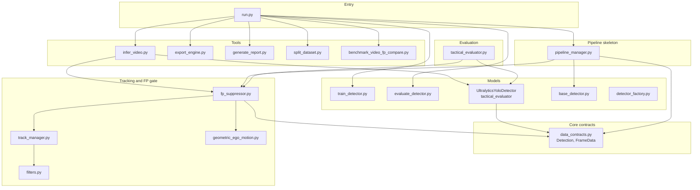
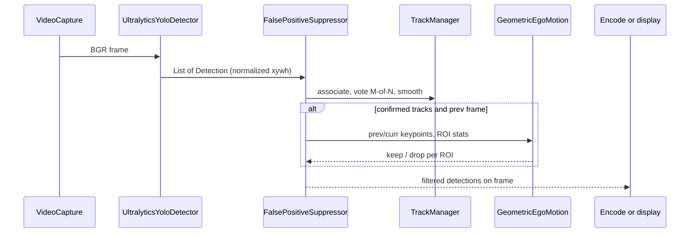

# AeroSentry — תיעוד ארכיטקטורה ופייפליין

תיקייה זו מרכזת **תיאור מערכת** (ארכיטקטורה, זרימות נתונים, שכבות אחריות). להרצה מעשית, דרישות והפקודות — ראו [`README.md`](../README.md) בשורש המאגר.

| מסמך | תפקיד |
|------|--------|
| **מסמך זה** | מפת שכבות, פייפליין end-to-end, מפת מודולים |
| [`PROJECT_GUIDE_HE.md`](PROJECT_GUIDE_HE.md) | עומק אלגוריתמי: TrackManager, GeometricEgoMotion, evaluate, בדיקות |
| [`GEOMETRIC_EGO_MOTION_RUN_EVIDENCE.md`](GEOMETRIC_EGO_MOTION_RUN_EVIDENCE.md) | הוכחת הרצה / לוגים לדוח |
| [`REPORT.md`](REPORT.md) | דוח בenchmark וידאו אחד ותמציתי (אנגלית): טבלאות + הסבר |

---

## 1. עקרון ארכיטקטוני

המערכת מפרידה בין **גילוי נוירוני** (YOLO / Ultralytics) לבין **לוגיקת זמן-אמת מבוססת מעקב וגאומטריה** (CPU, ללא רשת נוספת על FP):

- **מסלול GPU:** חילוץ bbox, class, confidence לכל פריים.
- **מסלול CPU:** איגום מסלולים (IoU + M-of-N), החלקת One Euro, ולאחר אישור — הערכת תנועת־מצלמה (ORB + RANSAC למודלים \(F\) / \(H\)) וסינון false positives גאומטרי.

כניסת CLI אחידה: [`run.py`](../run.py) (מפעילה מודולי `src/` ו־`tools/` לפי פקודת המשנה).

---

## 2. דיאגרמת שכבות (Layered view)



---

## 3. פייפליין וידאו (Production path)

זהו המסלול העיקרי להרצת משקולות אמיתיות על קובץ וידאו (`run.py infer` → `tools/infer_video.py`).



**תנאים לדילוג על גאומטריה:** אין מסלולים מאושרים, אין פריים קודם בזיכרון, או פריים ריק — ראו לוגים `[FalsePositiveSuppressor] geo skipped` ב־[`fp_suppressor.py`](../src/tracking/fp_suppressor.py).

---

## 4. פייפליין אימון והערכה (Offline)

| שלב | כניסה | ליבה | פלט / מטרה |
|-----|--------|------|-------------|
| אימון | `run.py train --experiment A\|B` | [`train_detector.py`](../src/models/train_detector.py) + `config/experiments.yaml` | `runs/detect/.../weights/best.pt` |
| מטריקות תמונה | `run.py eval` | [`evaluate_detector.py`](../src/models/evaluate_detector.py) | Precision / Recall / F1 לפי ספי conf |
| פיצול דאטאסט | `run.py split` | [`split_dataset.py`](../tools/split_dataset.py) | מחלקות train/val/test מודעות-רצף |
| ייצוא deployment | `run.py export` | [`export_engine.py`](../tools/export_engine.py) | ONNX / TensorRT (סביבה-תלוי) |
| דוח טקטי | `run.py report` | [`generate_report.py`](../tools/generate_report.py) + [`tactical_evaluator.py`](../src/evaluation/tactical_evaluator.py) | `TACTICAL_REPORT.md` ומדדים |
| השוואת FP על וידאו | `run.py compare-fp-video` | [`benchmark_video_fp_compare.py`](../tools/benchmark_video_fp_compare.py) | MD / CSV / JSON |

**חוזי נתונים:** [`Detection`](../src/core/data_contracts.py), [`FrameData`](../src/core/data_contracts.py) — תיבות בנורמליזציית YOLO, `track_id` אופציונלי אחרי שכבת המעקב.

---

## 5. מפת תיקיות (מודולי מקור)

```
aerosentry_task/
├── run.py                 # CLI מאוחד
├── config/                # dataset YAML, experiments A/B
├── src/
│   ├── core/              # חוזי נתונים משותפים
│   ├── models/            # אימון, הערכת תמונות, ממשק דטקטור, factory
│   ├── tracking/          # TrackManager, FP suppressor, ego-motion
│   ├── evaluation/        # אדפטר YOLO + דוחות טקטיים
│   └── pipeline/          # PipelineManager — דמו סטאב
├── tools/                 # infer_video, export, report, split, benchmark
└── docs/                  # תיעוד (מסמך זה ומדריכים)
```

---

## 6. הרחבות ונקודות עיגון

| רכיב | מטרה |
|------|------|
| [`BaseDetector`](../src/models/base_detector.py) | ממשק החלפה ל־PyTorch / TensorRT / סטאב |
| [`DetectorFactory`](../src/models/detector_factory.py) | רישום לוגי של backends (`yolov11`, `tensorrt`, …) |
| [`PipelineManager`](../src/pipeline/pipeline_manager.py) | לולאת וידאו מינימלית לבדיקת שלד (דטקטור ברירת מחדל: סטאב) |
| `run.py demo` | מפעיל `PipelineManager` על נתיב וידאו — **לא** משקולות Ultralytics |

להכנסה אלגוריתמית (ספי RANSAC, יחסי F/H, One Euro): [**PROJECT_GUIDE_HE.md §11–14**](PROJECT_GUIDE_HE.md).

---

## 7. סיכום מנהלים

- **ארכיטקטורה:** הפרדה ברורה בין *inference נוירוני* (Ultralytics) לבין *post-process טרנזקציוני-גאומטרי* (`src/tracking`).
- **פייפליין וידאו:** קריאת פריים → YOLO → (אופציונלי) `FalsePositiveSuppressor` → ויזואליזציה / קידוד.
- **פייפליין offline:** YAML דאטאסט → אימון Ultralytics → הערכת תמונות → דוחות וייצוא.

שאלות יישומיות (פקודות, GPU, נתיבי משקולות): [`README.md`](../README.md).
